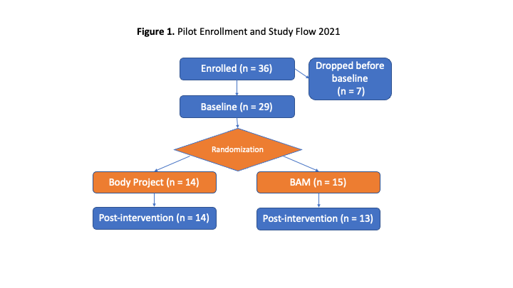

# Sample Description

In 2021, we ran a pilot version of this program with college students (N = 29), randomizing young adults to either a 2-session Body Project or Body Advocacy Movement (BAM; described below) intervention (see Figure 1 for Pilot enrollment). Average fear of fatness in the full sample at baseline was similar to samples of ‘repeat dieters’ (Goldfarb Fear of Fat Scale average at Baseline = 23.26), but lower than clinical samples of those with active EDs. A subsample in the second wave of recruitment completed a measure of ED history, with questions specifically assessing ED diagnostic criteria. Among this subsample of participants, 60% reported history of symptoms consistent with a full-threshold ED diagnosis (AN = 33%, BN = 20%, BED = 7%) and an additional 20% reported a history of subthreshold symptoms (Driven exercise to lose weight = 13%, Subclinical BED = 7%). 

```{r pilot, fig.cap="Pilot Sample 2021", out.width='98%', echo = F}

```

